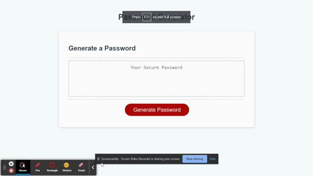
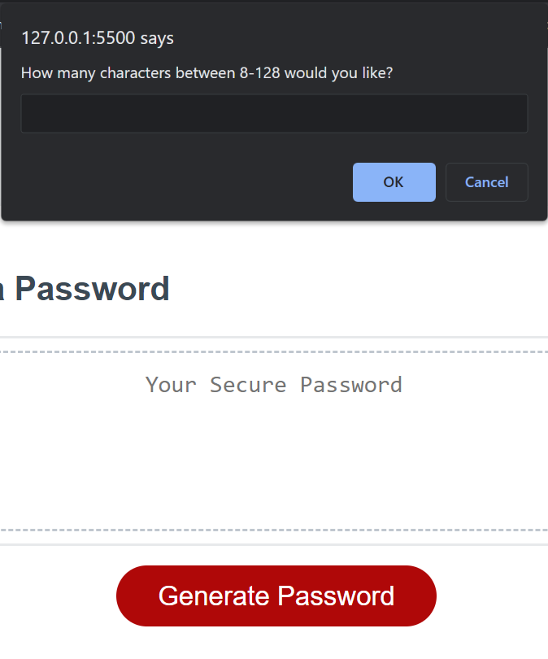

# password-generator

## Description
For this project I created a password generator using JavaScript. The criteria required the user to be able to select a password to be randomly generated between 8-128 characters. They could also select to include a combination of special characters, lowercase, uppercase and numbers. Once the user has inputted their choices the password is generated on screen for them to use.

## Technologies
HTML, CSS and JavaScript were used to create this project. To create this in Javascript I used if statements, prompts, confirms, loops, concatenation, for loops, math methods, query selectors, functions and more.

## Link
Github repo - [password-generator](https://github.com/Ryocon/password-generator)
 

Github pages - [Deployed](https://ryocon.github.io/password-generator/)

## Screenshots

A demo gif of the working project
 

 
A screenshot showing an example of one of the prompts available

 

